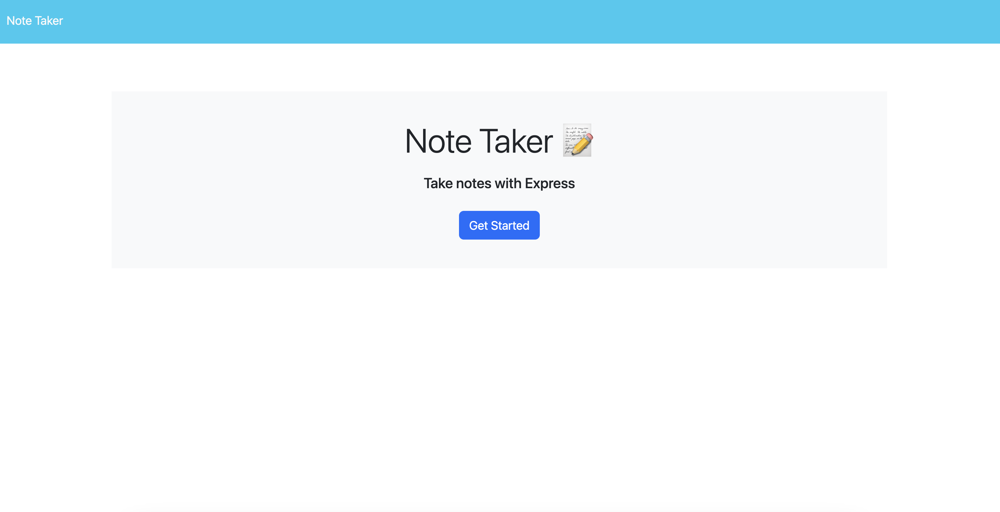
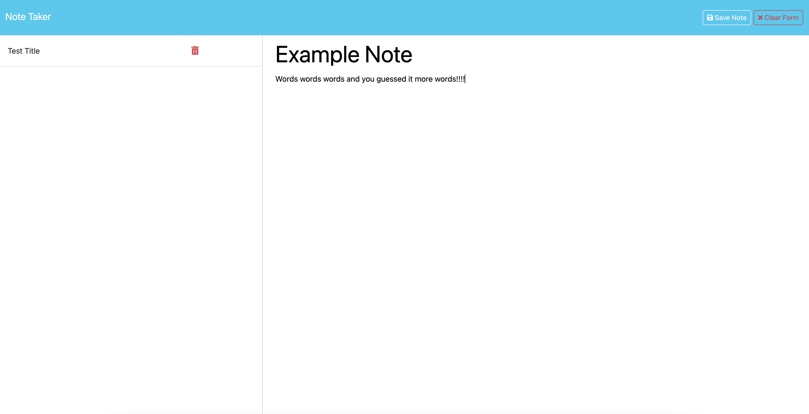

# NoteTaker2

Challenge 11 of Bootcamp is where I am to create an application called Note Taker. It will be used to write and save notes. It will use express.js back end. It will also save and retrieve note data from a JSON file. The front end has already been created and I will be created the back end. Both front and back end will be connected by me and I will deploy it to render.

## Technologies & Resources 
Visual Studio Code
    This is the program used to write all the code for this challenge.  Below are the links to the website and their license.
    https://code.visualstudio.com/
    https://code.visualstudio.com/License/

Github
    This program was used to upload my code so it is saved and others can view what I have done.  Below are the links to the website and license.
    https://www.github.com
    https://docs.github.com/en/site-policy/github-terms/github-terms-of-service

Xpert Learning Assistant
    The Xpert Learning Assistant is a chat AI program created by the Full-Stack Web Development program to assist students, like myself, with any questions they may have.

ChatGPT 3.5 
    I used this AI to help further my understanding of back end coding. It helped with clarification from what Xpert Learning Assistant was giving me and I was still was not understanding. 
    https://chat.openai.com/ 
    https://openai.com/policies/terms-of-use

NPM
    This is website offers documentation on different npm packages to enhance my code, more specifically the node_modules folder. 
    https://www.npmjs.com/

Cors
    CORS is a node.js package for providing a Connect/Express middleware that can be used to enable CORS with various options.
    https://www.npmjs.com/package/cors
    MIT

## Acknowledgements
John Brooks- Full Stack Developer I
    My brother in law tried helping me figure out why this application was not functioning properly.  He was able to help me catch a few minor errors I had made and I appreciate him for being my second set of eyes while we looked over my code.

Yuge
    Yuge is one of my friends who previously worked in this field. I appreciate him helping me understand the errors I was seeing in the console and walking me through going from several errors down to one. 

J.D.- Senior Software Engineer
    I'd like to thank JD for sitting down with me for a couple of hours having me debug my code.  We found that my code looked great but there was possibly something small causing it to not function properly.  So he helped me by "starting over," we started a new file and went piece by piece testing my code.  It was a long process, but the feedback he gave and assisting me with testing it was truly appreciated and a great learning experience.  We did successfully find the issue and it was indeed something small! 

## License
MIT

## Live URL & Application Screenshots

## GitHub 
https://github.com/Sashuttle
